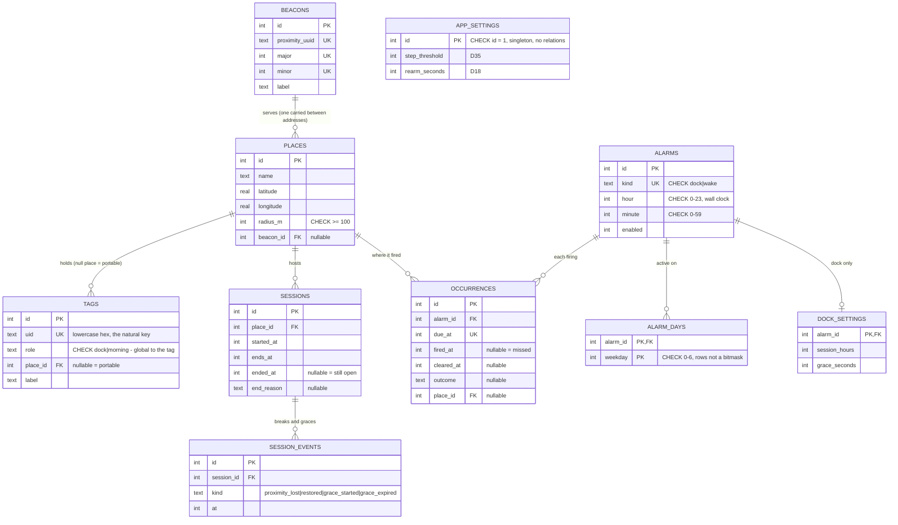

# Anchor — plan

Status: **audited, pre-build.** Nothing here is built. Converged through `/house-plan` twice — once
on the design, once against §1's threat model, which produced the build phases in §3.

**Read §1 and §3 first.** §1 says who this defends against and is the brake on adding machinery. §3
is the build order — v1 is the release and v1 is everything here; the phases are how it gets built,
not what goes out when.

---

## 1. The problem

Two failures at opposite ends of the same night:

1. **Getting up.** An alarm within arm's reach gets dismissed while unconscious.
2. **Getting to sleep.** The phone in bed pushes bedtime back indefinitely.

Both are solved by the same physical fact: **the phone is not where you are.** Anchor enforces that
with alarms that can only be silenced somewhere else in the room, or the house.

### Who this defends against

**A tired person who wants better sleep, and nobody else.** Not an attacker, not a determined
cheater, not a future stranger. The user is the person the app is helping, and they installed it on
purpose.

This is a scope brake, and it should be used as one:

- **A bypass that takes deliberate effort is not a defect.** Force-quitting, reinstalling, shrinking
  a radius the night before, unsticking a tag and moving it next to the bed — all of these work, and
  none of them need fixing. Someone doing that has decided not to use the app, which is their right.
- **Most bypasses are self-policing anyway.** Nearly every one requires picking up the phone, which
  is across the room. Getting up to defeat the app is getting up.
- **Setup honesty is the user's job.** Putting the dock on the far side of the room and the morning
  tags in other rooms is discipline the app cannot supply and should not pretend to. It can only make
  the honest setup work well.
- **Friction is for the half-asleep, not the determined.** Ten seconds of grogginess is the whole
  design target. Anything that only stops a wide-awake, motivated person is machinery with no job.

Where a rule below closes a loophole, it should also have an independent reason to exist —
correctness, honesty about degraded state, or not being annoying. If bypass-closing is its *only*
justification, it is over-engineering and should be cut.

## 2. Two features, not one flow

**This is the structural decision the rest of the design follows from.** Bedtime and morning are two
independent alarms, each configured like a normal alarm app — its own time, its own weekdays, its own
enable switch. Neither depends on the other having run.

### Feature A — Dock (evening)

| | |
| --- | --- |
| Fires | At its scheduled time, only when inside a known place |
| Cleared by | **Tag A — the dock.** Across the room or in another room. Explicitly *not* the bedside table |
| Then | The **dock session** begins: the phone must stay at the dock |
| Gives up | After a period of no interaction at all |

### Feature B — Wake (morning)

| | |
| --- | --- |
| Fires | At its scheduled time, wherever the phone is |
| Cleared by | **Tag B — the morning target.** Bathroom, kettle, front door |
| Away from any known place | Degrades to a normal dismissible alarm (see §5 D9) |
| Gives up | **Never** |

**Why two tags.** If Tag A also cleared the morning alarm you would tap it while already standing at
the dock and return to bed. The morning alarm's job is to get you out of the bedroom, so the tag that
clears it must live outside the bedroom.

**Why the evening one is an alarm and not a reminder.** A notification is dismissible from bed. The
premise of the app is that the only accepted proof is physical presence at a specific object.

**The one seam between the features.** Proximity enforcement must be suspended while the wake alarm
is alerting, or carrying the phone to Tag B would trigger a "phone left the dock" alarm. This is the
single point where the two features touch. It is named here rather than hidden because getting it
wrong produces an alarm at exactly the wrong moment.

### Leaving while an alarm is ringing

**A confirmed exit from the active place stops any alarm currently alerting.** Both features. If you
have left the house, the tag that would clear the alarm is unreachable, and a phone screaming in
public with no way to silence it is a worse outcome than a missed enforcement.

**The exit must be confirmed, not merely reported.** A region-exit event alone is not enough — GPS
drifts indoors, and a spurious exit at 07:00 would silently cancel the alarm and let you oversleep.
Corroborate with a fresh fix showing real distance beyond the radius. **If the fix is unavailable or
ambiguous, keep ringing.** This is the same bias as everywhere else in the app except proximity.

**Confirmation is automatic, with no button to press.** While any alarm is alerting, location runs at
high accuracy continuously, and every re-arm cycle takes a fresh fix. A real departure is therefore
confirmed within seconds of the phone getting a clean reading, without the user doing anything.

Waiting on iOS's own region-exit debounce would leave the alarm ringing all the way down the street;
polling directly is what makes the rule usable rather than decorative.

**It must be bounded, because the wake alarm never gives up (D5).** "Only while an alarm sounds" is
not self-limiting: an unanswered wake alarm rings indefinitely, and continuous high-accuracy location
alongside it would drain the battery flat — on the one morning nobody is there to notice. Cap the
high-accuracy window at a few minutes from first ring, then fall back to coarse monitoring. A
departure that has not happened in the first few minutes is not the case this rule exists for.

**What happens on return differs by feature, because their success conditions differ.**

| | On confirmed exit | On return |
| --- | --- | --- |
| **Feature B — wake** | Stops for that occurrence | **Does not resume** |
| **Feature A — dock** | Stops | **Resumes**, inside its window |

The wake alarm exists to get you awake and out of the bedroom. Walking a hundred-plus metres from
the house proves that more comprehensively than scanning Tag B ever could — the alarm's goal is
already met, so bringing it back would be punishing success.

The dock alarm exists to get the phone onto the dock. Leaving the house does not achieve that at
all, so the obligation is genuinely still outstanding when you walk back in, and the alarm should say
so. That it also happens to close a loophole is a side effect, not the reason.

**The radius is user-configurable, floored at 100m** because iOS geofencing is unreliable below
that. Larger means a genuine departure takes longer to register. It is a tuning parameter, not a
difficulty setting — see §1 on what this app is and is not defending against.

## 3. Build phases

**v1 is the release, and v1 is everything in this document.** Nothing here is cut, and nothing ships
in between. These are phases of one build, ordered by dependency and by risk — not increments that
go out separately.

The order matters for two reasons: later phases genuinely cannot be built before earlier ones, and
the two phases most likely to fail are cheap to attempt and expensive to discover late.

**The app builds and works at the end of every phase** (D36). Each is additive over a working base,
never a half-wired intermediate. That is why the all-or-nothing release costs nothing — stopping
anywhere leaves something usable, and the release date is a choice rather than the first point at
which the thing runs.

### Phase 0 — the template

The scaffold everything sits in, and **the rules made enforceable before there is any code to violate
them**. Build steps 1–2. No behaviour, no AlarmKit, no NFC, no Apple account.

Three things must exist before the first line of `core/`, because each is trivial now and retroactive
surgery later:

- **The `core/` purity lint rule**, or `core/` acquires an `expo-sqlite` import and nobody notices for
  a week.
- **The test harness**, since D37 makes a rule without a test unfinished — the harness cannot lag the
  rules it is supposed to gate.
- **The `.ios.ts` / `.android.ts` seam**, so there is never a "just this once" `Platform.OS` in `ui/`.

Full recipe in §13 step 2.

### Phase 1 — the alarm core

Everything else sits on this. A morning alarm that only a registered tag can silence, with no
location and no Bluetooth involved.

| | Decisions |
| --- | --- |
| Tag matching on UID, empty never matches | D1, D22 |
| A role accepts any of its registered tags | D31 |
| Tags may be fixed or portable | D34 |
| Scan accepted only after ~15 steps since first ring | D35 |
| Re-arm on Stop | D2, D18 |
| Never gives up | D5 |
| Escape hatch — press and hold, always available, never refused | D20 |
| Cannot enable an alarm with no registered tag; deleting a tag disables it | D27 |
| Records whether each alarm actually fired, misses inferred on launch | D25, D29 |
| Wall-clock local schedules | D23 |
| SQLite holds intent; AlarmKit is derived; reconcile on launch | §12 |
| Settings freeze ±1h around the alarm | D7 |

### Phase 2 — places and geofencing

Places (D30, D32, D33), the exit rules (D3, D12, D13, D19, D26), away-from-home degradation (D9), and
the configurable radius (D14). Needs Phase 1's alarm lifecycle to attach to.

### Phase 3 — Feature A, the evening alarm

The dock alarm, Tag A, early docking, and D21's extension of the settings freeze. Needs Phase 2,
because Feature A only fires inside a known place.

### Phase 4 — dock sessions and proximity

The beacon, D11, D16, D24, the grace period (D17) and session persistence (D15). Last because it
needs hardware, a second native module, and an observation period before it is allowed to ring
anything — not because it is optional. It is what makes the dock session a real behaviour rather
than a one-time tap.

### Rough effort

Solo, LLM-assisted, learning Expo along the way. Working days, not calendar days.

| Phase | Days | Where the variance is |
| --- | --- | --- |
| 1 — alarm core | 8–14 | Scaffold, Drizzle's bundled-migration dance, all of `core/` and its tests, the simulator, the harness, NFC, the AlarmKit spike, a SwiftUI widget extension, registration UI, escape hatch, occurrences, reconciliation — on a stack being learned |
| 2 — places and geofencing | 3–5 | Permission handling, and testing means repeatedly leaving the house |
| 3 — Feature A | 2–3 | Mostly reuses Phase 1's machinery |
| 4 — sessions and proximity | 4–6 | Second native module, plus tuning TX power by trial |
| Polish | 2–4 | Open-ended by nature |

**Roughly 4–6 weeks full-time equivalent.**

An earlier draft of this table said 2–4 weeks and was optimistic by roughly half. Phase 1 alone
carries the entire foundation plus two native integrations, and `@bacons/apple-targets` is a day or
two of yak-shaving the first time regardless of how well the logic goes.

The estimate assumes current-generation assistance, but that multiplier has to be applied carefully.
a mature repo in the same TypeScript stack averaged ~127 commits a month over its first five and ~490 over its last seven —
but that measures velocity on a **familiar codebase in a familiar stack**, which is the opposite of
Phase 1 here. Treat it as evidence about the specified-logic parts, not about the total.

**Where that speed actually lands:** `core/` and its tests, the schema and migrations, golden traces,
UI screens — anything already specified in this document, which is most of Phase 1 and 3. **Where it
does not:** debugging a community native bridge that misbehaves, tuning beacon TX power by trial, and
anything requiring a device in a place. Phase 4 barely moves.

**Some of it cannot be compressed by working harder.** The AlarmKit entitlement sits in a queue of
unknown length. Proximity needs one to two weeks of *nights* in observation mode before it is allowed
to ring anything. Geofence behaviour can only be checked by actually going out and coming back. Those
are calendar time, not effort, and they run in parallel with other phases rather than blocking them.

### The two phases that decide whether this works

**The AlarmKit spike inside Phase 1** and **the proximity observation inside Phase 4** are where this
most plausibly dies. Both are cheap to attempt and expensive to discover late, which is the whole
argument for the ordering. The AlarmKit spike runs in the simulator with no account at all (§14), so
there is no reason to defer it.

### The gate between Phase 1 and Phase 2

**Use Phase 1 for a fortnight before starting Phase 2.** Not "it would be nice to" — an actual stop,
with a duration.

D36 guarantees the app *runs* at the end of every phase. It does not guarantee you *stop and use it*,
and those are different things: the first is a build property, the second is the only way to learn
whether walking to a tag actually gets you up. That answer shapes how much the later phases need to
do, and it is unavailable from the code.

Release is still all-or-nothing. Using it early is not shipping it.

## 4. Prior art

Both halves exist separately. The pairing does not.

- **Morning NFC alarms** — crowded: Tagdawn, Chirp O'Clock, Moti (iOS); Sleep as Android, NFC Alarm
  Clock (Android).
- **Bedtime NFC-gated app blocking** — exists: Foqos, AppToken (iOS); UpDude (Android).
- **An alarm that rings until the phone is docked away from the bed, and keeps it there** — no
  product found.

Personal-use tool first. Shipping is a possible later outcome, not a design constraint now.

## 5. Decisions already made

Each is load-bearing. Changing one changes the design.

| # | Decision | Why |
| --- | --- | --- |
| D1 | Tag identity is the **hardware UID**, never the NDEF payload | A payload copies onto a spare sticker kept under the pillow, defeating the premise |
| D2 | Enforcement is **re-arm**, not block | `stopButton` is deprecated in iOS 26.1 ("not used anymore"); the Stop button is system-owned and cannot be removed |
| D3 | Only a **confirmed exit transition** may silence a ringing alarm. A static "presence says away" reading may not, and `unknown` never may | A geofence glitch at 03:00 must not be able to cancel the alarm that wakes you. Requiring a corroborated transition keeps that protection while allowing the deliberate case (D12) |
| D4 | `unknown` location is **not** `away` | Treating no-fix-yet as absence silently weakens enforcement |
| D5 | Feature A gives up; **Feature B never does** | An alarm you can outlast is an alarm you learn to outlast |
| D6 | Give-up is measured by **absence of interaction**, not motion sensing | iOS exposes no "user unlocked the phone" API; pressing Stop already proves presence, and costs no permission. Note this is not contradicted by D35: that queries a *past* step count over a fixed window, which CoreMotion supports well; D6 rejected *live* background motion monitoring to infer presence, which it does not |
| D7 | Settings freeze **±1 hour** around either alarm | Otherwise bedtime moves an hour later at 22:29 |
| D8 | Everything on-device. **No server.** | No account, no sync, no privacy surface, nothing to run |
| D9 | Outside every known place, Feature B **degrades rather than disappears** | The morning tags are all elsewhere and unreachable. Suppressing the alarm means oversleeping; keeping it un-clearable means an alarm with no off switch |
| D10 | The two features are **independent** | Each is configured like a normal alarm. Feature B fires whether or not you docked last night |
| D11 | The dock session is **enforced by proximity** | Without it there is no session — only a one-time tap, after which the phone can sit in bed all night. Proximity is what makes "the phone stays at the dock" a real behaviour rather than a claim, so this is the feature itself, not a guard bolted onto it |
| D12 | Leaving the active place while an alarm is alerting **stops it** — both features | The clearing tag is unreachable once you have left, and a phone screaming in public with no off switch is worse than a missed enforcement |
| D13 | On return, the **dock alarm resumes** and the **wake alarm does not** | Their success conditions differ. Walking 150m from the house already proves you are awake and out of bed, so the wake alarm's goal is met. It does nothing to put the phone on the dock, so that obligation is genuinely still outstanding and the alarm should say so |
| D14 | A place's radius is **user-configurable**, floored at 100m | iOS geofencing is unreliable below 100m, so the floor is a hardware limit rather than a policy. Above it, larger simply means a real departure takes longer to register |
| D15 | The dock session **persists across restart and force-quit** | Phones reboot and apps get killed for reasons that have nothing to do with the user. A session that forgets itself on a crash is simply broken |
| D16 | A session ends on **confirmed geofence exit, or a user-set duration** from its start — whichever first | It must not depend on Feature B's alarm time; B may be disabled entirely (D10). A session that never closes corrupts the following night |
| D17 | A **resumed or proximity-broken** dock alarm vibrates and notifies first, sounding only after a user-set delay unless docked | Coming home at 01:00 should not blast sleeping housemates. It also downgrades a 03:00 proximity false positive from a siren to a vibration — the best available mitigation for the project's highest risk |
| D18 | The re-arm delay **shortens with each cycle**, to a floor of ~10s | Stalling should get progressively worse rather than stay comfortable. The floor stops it becoming unsatisfiable — below roughly 10s you cannot cross a room before it fires again |
| D19 | While any alarm alerts, location runs at **high accuracy**, capped at a few minutes from first ring | Makes D12 confirmation automatic with zero taps. The cap exists because D5 means an unanswered wake alarm rings forever, and unbounded GPS beside it would flatten the battery |
| D20 | There is an **escape hatch**: a long-press-and-hold override that cancels any alarm and any session outright, logged and discouraged by **escalating friction** — never refused | Illness, emergencies, and a lost or unreadable Tag B otherwise leave an alarm that literally cannot be stopped. An app that can trap its user is worse than one that can be cheated |
| D21 | D7's freeze covers **session duration and grace settings**, not just alarm times | The same reasoning as D7: these are the settings that would be edited in the moment rather than deliberately. No blanket freeze during a session — changing anything means walking to the phone, which is what the app wanted |
| D22 | **A tag has exactly one role, everywhere.** Registering a tag already bound to the other role is rejected | Per-place roles would let a tag be dock at home and morning elsewhere — and since matching is by role, that tag would then clear the morning alarm *while sitting on the dock beside the bed*, which is the precise thing §2's two-tag split exists to prevent. Tags cost pennies; buy another rather than reuse one |
| D23 | Schedules are **wall-clock local**, and a session's duration is **absolute elapsed time** | The alarm should fire at 07:00 on the clock in the room. Sessions must not gain or lose an hour at a DST boundary |
| D24 | Bluetooth off at dock time **refuses to start a session**; switched off mid-session it **ends the session and records it** | Without Bluetooth the session genuinely cannot be enforced, and an app that says it is guarding something while doing nothing is lying. Say so at the start rather than fail quietly at 03:00 |
| D25 | Every alarm occurrence records **whether it actually fired**, surfaced on the home screen | The worst failure is silent: a broken bridge means no alarm and no warning. An alarm app that fails quietly has actively harmed the user |
| D26 | A D12 stop of the **wake** alarm is **provisional** for a few minutes — a confirmed return inside that window resumes it. High-accuracy location **runs for at least this window**, overriding D19's cap | D13 removed the safety net, so a confident-but-wrong fix would kill the alarm permanently. The override matters: if D19 dropped to coarse first, the corrective fix would never arrive and the provisional window would be decorative |
| D27 | An alarm **cannot be enabled without its clearing tag registered**, and deleting a tag disables the alarm that depends on it | Otherwise the first night ends in an alarm nothing can clear. The deletion half matters just as much — the invariant is "an enabled alarm always has a way to be cleared", not merely a check at creation |
| D28 | Clearing the wake alarm **ends any open dock session** | Extends the §2 seam. Otherwise the session outlives the morning and carrying the phone to Tag B trips a dock alarm minutes after getting up |
| D29 | A missed firing is **inferred lazily**: on launch, any occurrence past due with no `fired_at` is a miss | If the bridge fails, the app is never launched, so nothing is running to record the failure at the time. Detection has to be retrospective or D25 does not work at all |
| D30 | There are **many places**, not one home. Every rule that said "the home region" means **the active place** | Living across two or three addresses is normal. A single hard-coded home makes the app useless at the second one |
| D31 | A role accepts **any of its registered UIDs**, not one tag | This is what makes multi-location work with no other machinery: a morning tag in each kitchen, and whichever you reach satisfies the alarm. Phase 1 needs nothing beyond this |
| D32 | Schedules are **global**; places carry hardware and geography only | Per-place schedules mean arriving somewhere new and silently having no alarm. Your wake time does not depend on which bed you woke in |
| D33 | Features **degrade per place** according to the hardware installed there, and the app says so at setup | Partial kit is the normal case — full setup at home, two tags at a parent's, nothing in a hotel. A place with a dock tag but no beacon runs Feature A unenforced, which the user must be told rather than left to discover |
| D34 | Tags may be **fixed or portable**; a portable tag belongs to no place | Fixed tags cannot cover hotels, travel, or a first night somewhere new. Portability is what makes the app work anywhere, and D35 is what stops it being a free pass |
| D35 | **For portable tags only**, a scan is accepted after **N steps since the alarm first rang** (`CMPedometer`, default ~15; can be switched on for fixed tags too) | A fixed tag in another room already required the walk, so the gate never binds there and could only ever fire when wrong — phone in a bag, a small flat, permission denied. A portable tag has no location at all, so steps are the *only* thing making it meaningful. Scoping it there is what keeps it from being the bypass-closing-for-its-own-sake §1 forbids |
| D36 | **Every phase ends with a building, working app.** No phase may leave it half-wired | Each phase is additive over a working base, so stopping anywhere leaves something usable rather than a shell. It also keeps the seams honest — if adding places breaks the alarm, the layering was wrong, and that shows up at the end of the phase rather than at the end of the build |
| D37 | **Every business rule has a test.** A rule in `core/` without one is unfinished, not merely untested | `core/` is pure and needs no mocking, so the excuse for skipping is absent. It is also the only surface verifiable without sleeping — an untested rule there will first be checked by experiencing it at 03:00 |
| D38 | **Charging state vetoes a proximity alarm.** If the phone is still charging, it has not been picked up, whatever the beacon reports | Free and permissionless, and it attacks the highest-rated risk in the plan directly. It cannot replace the beacon — battery-state changes get no background execution, so only a region exit can wake the app — but as a veto it costs nothing |

## 6. The dock session

Scanning Tag A starts a dock session — whether the alarm summoned you or you docked early.

**Early docking is allowed and encouraged.** Scanning Tag A before the scheduled time cancels the
pending alarm and starts the session immediately. Going to bed early should never be punished.

**During the session**, a BLE beacon at the dock is monitored. If the phone leaves the beacon's range
and stays gone past a debounce window, the dock alarm resumes. This is what makes early docking safe:
without it, docking at 20:00 and retrieving the phone at 20:05 defeats the whole feature.

**The session has a user-set duration** — X hours from the moment it starts. It ends when that
elapses, or on a confirmed exit from the active place, whichever comes first. It does **not** reference
Feature B's alarm time: the features are independent (D10), Feature B may be disabled entirely, and a
dock session must work with no morning alarm configured at all.

**The session survives a restart or a force-quit.** Start time and duration are persisted, and a cold
launch rehydrates any session still inside its window. Without this, "restart the phone" is a
one-step bypass of the whole feature.

**Proximity runs only while at home,** and is suspended from the moment Feature B starts alerting
until the session ends (§2) — clearing the wake alarm ends any open session outright (D28). Without
that, a session configured to run past the morning would trip a dock alarm minutes after you got up,
while the phone was in your hand on the way to Tag B. Outside a known place there is no dock and
nothing to enforce.

### The grace period

**A resumed or broken dock alarm does not start at full volume.** It vibrates and posts a notice
first, then sounds after a user-set delay — 30 seconds, 1 minute, 5 minutes — unless the phone is
docked in the meantime.

**It must be implemented as a scheduled alarm, not a background timer.** iOS grants roughly ten
seconds of execution after a beacon or region event — nowhere near a five-minute wait. So the grace
is: on the break, post the notification and immediately *schedule* an AlarmKit alarm for
`now + grace`, then cancel it if the phone docks in time. The waiting is the OS's job. A
`setTimeout` here would simply never fire, and the failure would be silent.

This exists so that coming home at 01:00 does not blast a house full of sleeping people for something
only the phone's owner cares about. The scheduled bedtime alarm has no grace; it fires at a time the
household already expects.

The grace also happens to be the best available mitigation for the project's highest risk. A
proximity false positive at 03:00 becomes a vibration and a notification rather than a siren, and if
the beacon reappears within the window nothing sounds at all. **Apply it to proximity breaks as well
as re-entry**, for exactly that reason.

### Why this is the riskiest part of the design

A proximity false positive is an alarm at 03:00 for no reason — **worse than the problem the app
exists to solve.** The failure modes are real and must be designed for, not discovered:

| Mode | Detection difficulty | Handling |
| --- | --- | --- |
| Beacon battery dies mid-night | Silent — indistinguishable from "phone moved" | Warn on weakening signal; verify the beacon is visible *at dock time* and refuse to start a session without it |
| BLE flapping at low TX power | Silent | Debounce: require N consecutive seconds of absence, not a single missed advertisement |
| Bluetooth switched off | Detectable | Never treat as "phone left" — but refuse to start a session without it, and end a running session if it goes off (D24). Claiming to guard something while doing nothing is the failure here, not the toggle |
| Phone at the edge of range | Silent | Tune beacon TX power so the boundary is well inside the room, not at the doorway. Charging state (D38) also vetoes: a phone still on the charger has not moved |

**The bias throughout is toward silence.** Where proximity state is uncertain, do not ring. This is
the opposite of the bias everywhere else in the app, and deliberately so: a missed enforcement costs
one night's discipline, a false positive costs a night's sleep and the user's trust in the app.

## 7. Places

The app cannot assume one home. Living across two or three addresses is normal, and the hardware may
be permanently installed at one and carried to another.

**A Place is a region plus whatever hardware is installed there:** a name, a centre and radius, an
optional dock tag, an optional morning tag, an optional beacon. Everything that previously said "the
home region" now means **the active place** — whichever place the phone is currently inside.

**Schedules stay global.** Your wake time is your wake time wherever you slept; per-place schedules
would mean arriving somewhere new and silently having no alarm. Places carry hardware and geography,
not times.

### Roles accept a set of tags, not one tag

This is the piece that makes multi-location work with almost no machinery. A role — `dock` or
`morning` — accepts **any** of its registered UIDs. Stick a morning tag in each kitchen and the wake
alarm is satisfied by whichever one you reach.

**Phase 1 needs nothing more than this.** No regions, no beacons, no place records — just more tags bound
to the same role. Places only become necessary for Feature A, which is the one that needs to know
*where* the dock is and which beacon guards it.

### Partial hardware is the normal case

A place will often have less than the full kit: everything at home, two tags at a parent's house,
nothing in a hotel. Features degrade per place rather than failing:

| Place has | Behaviour |
| --- | --- |
| Dock tag + beacon | Feature A fully enforced |
| Dock tag only | Feature A runs, but the dock session is unenforced — early docking is exploitable there, and the app should say so plainly when the place is set up |
| Morning tag only | Feature B works normally |
| Nothing registered | An *unfurnished* place — known location, no hardware. Feature A suppressed, Feature B degrades to dismissible (D9). This is **not** D4's `unknown` location, which means no fix at all and suppresses nothing |

### Portable tags

A tag need not belong to a place at all (D34). A fob on a keyring or a card in a wallet works
anywhere — hotels, a first night somewhere new, travel — which is the gap places alone cannot fill.

The obvious objection is that a carried tag can simply be put next to the bed, and scanned lying
down. **The step requirement (D35) is what removes that**, and it is why portability costs nothing:
what proves you got up is the walking, not the tag's coordinates. A portable tag on the nightstand
accumulates zero steps and is refused exactly as a fixed one would be.

This also means a place with **no tags at all** is still usable if you carry one.

### Moving the hardware

One beacon can serve several places, because only one place is occupied at a time — carry the ESP32
and re-point it, rather than buying one per address. Tags are cheap and stuck down, so those are
per-place. Re-assigning either is a settings change, not a re-pairing.

### Which place am I in?

Nearest centre wins; an ambiguous overlap resolves to the most recently active place. Two flats in
the same building are the realistic failure case, and the honest answer there is a smaller radius,
which D14's 100m floor may not allow — in which case those two addresses are one place as far as the
app is concerned.

**iOS monitors at most 20 regions** across the whole system. A handful of places is fine; this is a
cap to remember, not one to design around.

## 8. Escape hatches, permissions, and degraded states

### The escape hatch (D20)

Feature B never gives up (D5) and is cleared only by Tag B. If Tag B is peeled off, lost, or simply
unreadable, the alarm rings **forever**, and the only exit is walking past the home radius. The same
trap catches genuine emergencies and illness.

So: a deliberate, awkward override — press and hold for several seconds — that cancels the current
alarm and any open session outright. It is logged and shown in history.

**It is never rate-limited to the point of refusal.** A hard cap would reinstate exactly the trap
this exists to remove: exhaust the week's allowance, lose Tag B, and there is no way out at all.
Overuse is discouraged by **escalating friction** — a longer hold, a confirmation, a visible count in
history — never by refusing. Friction is a deterrent; a locked door is a defect.

It also does not weaken Feature B, because the phone is across the room at the dock. Reaching it to
press and hold is precisely what the alarm was demanding.

**Where it lives is constrained by AlarmKit.** The alert surface exposes exactly one
`secondaryButton` — confirmed from the SDK interface, and `stopButton` is deprecated besides. So the
alert cannot carry both "scan tag" and "override". The secondary button opens the app, and the app
presents both. The escape hatch is therefore always two steps away, which is a reasonable amount of
friction for something that should be rare.

**An app that can trap its user is worse than one that can be cheated.** This is the one place where
that trade is made explicitly.

### Permissions, and the ways they rot

The app needs AlarmKit authorisation, NFC, Bluetooth, Notifications, **Motion & Fitness** (D35), and
**Location: Always**.

Location Always is the fragile one. iOS may downgrade it to *While Using* — at the prompt, at the
"still allowing?" re-prompt weeks later, or on reinstall. Every location-dependent rule (D3, D12,
D19, D26, and the geofence gate on Feature A) **fails silently** when that happens.

Treat a downgraded or missing permission as a **loud, blocking state**: the home screen says the app
cannot do its job, and Feature A refuses to arm rather than arming and quietly not enforcing. Never
degrade silently — silent degradation on an alarm app means oversleeping without knowing why.

### Reboot

AlarmKit alarms are system-scheduled and survive a restart, but iOS does **not** resume region
monitoring until the device has been unlocked once. A phone that dies at 03:00, is charged at the
dock, and reboots at 05:00 has no geofencing until it is unlocked — which will not happen while the
user is asleep.

The wake alarm should still fire. The location-dependent rules will not work until first unlock, and
that is acceptable provided nothing depends on them *to ring*. Verified in build step 8, not assumed.

### Both alarms ringing at once

D10 makes the features independent, so nothing prevents identical or overlapping times. When two
alarms are alerting, a scanned tag clears **the alarm whose role it matches**, not "the one currently
ringing" — the rule in §11 is written per-role for exactly this reason. Overlapping schedules should
also be flagged at configuration time, since it is almost always a mistake.

### Time changes

Schedules are wall-clock local (D23): 07:00 means 07:00 on the clock in the room, including the day
the clocks change. A session's duration is absolute elapsed time, so it neither gains nor loses an
hour at the boundary. Crossing a timezone re-bases the schedule to local time; places do
not move, so away-from-home behaviour (D9) applies as usual.

## 9. Stack

Chosen to maximise transfer to the existing Next/T3 work, and because Expo's first-party agent
tooling is now good.

| Layer | Choice | Note |
| --- | --- | --- |
| Framework | Expo + TypeScript, **dev client** | Expo Go cannot load native modules; prebuild from day one |
| Package manager | **npm** | See below — a deliberate choice, not a default |
| Routing | Expo Router | Same file-based mental model as the Next App Router |
| UI | NativeWind | Tailwind classes; carries the 4-point spacing discipline over |
| DB | Drizzle + `expo-sqlite` | Same ORM idiom as the existing repo |
| Alarm (iOS) | `expo-alarm-kit` or `react-native-nitro-ios-alarm-kit` | Community packages — pin exact versions. **iOS deployment target 26.0**, so the app runs on nothing older. `expo-alarm-kit` requires an App Group whose identifier must match its `configure()` call exactly; the Nitro module needs a physical device and no-ops entirely on Android |
| Alarm UI (iOS) | `@bacons/apple-targets` → widget extension | `AlarmAttributes` is an `ActivityAttributes`, so this is mandatory |
| NFC | `react-native-nfc-manager` | Covers both platforms |
| Proximity | `react-native-beacon-radar` | iBeacon, Expo-compatible in a dev build, has background scanning |
| Geofence | `expo-location` + TaskManager | Covers both platforms |
| Payments (deferred) | RevenueCat | Only if this ever ships |

### Package manager: npm, for one specific reason

Expo supports npm, Bun, pnpm and Yarn as first-class options, and Bun is materially faster.

**pnpm is the worst fit.** Its isolated install strategy is the default and React Native needs
`node-linker=hoisted`, which discards the very thing pnpm is for.

**Bun is a reasonable choice** — hoisted by default, so the `node_modules` layout matches npm's, and
installs are much faster.

**npm anyway, for Phase 0.** Two of the three native modules are young and community-maintained, and
every one of their READMEs, every error message, and every community answer assumes npm. Phase 0's
entire job is establishing a baseline that works; when `expo prebuild` fails against an AlarmKit
bridge, the question must be *what is wrong with the bridge*, never *is it the package manager*.

Swap to Bun once the baseline is green if install time becomes irritating. That is a cheap,
reversible change later and an unnecessary variable now.

### Hardware — roughly £10, and the same kit serves Android later

| Item | Cost | Notes |
| --- | --- | --- |
| NTAG213 stickers ×10–20 | ~£5 | Matching is on **UID only** (D1), so no storage is needed and the cheapest tag is the right one |
| ESP32 board as an iBeacon | ~£3–5 | Flashed via ESPHome; TX power settable −12 to +9 dBm |

Any two NFC cards already in a drawer would work — **except payment cards**, which randomise their
UID by design. Stickers are worth buying anyway, because the tags need mounting on a wall or a kettle.

**Run the beacon off USB at the dock.** There is a plug there already, since that is where the phone
charges. This is not a convenience: it deletes the "beacon battery dies mid-night" failure mode
outright, which §6 rates high-severity and silent. A hardware choice removing a whole risk row is
worth taking.

**TX power is the one thing to get right.** A stock beacon reaches 10–70m and would cover the entire
flat, enforcing nothing. The ESP32 floor of −12 dBm may still be too coarse for a single room; if
build step 10 shows the boundary landing outside the doorway, a USB beacon with a −40 dBm floor
(around £25) is the fix. Start cheap — step 10 exists precisely to measure this.

**Agent tooling, set up before the first line of code:** Expo Skills (`github.com/expo/skills`), the
Expo MCP server (`docs.expo.dev/mcp`), and `llms.txt` so docs come from current Expo rather than
model memory.

## 10. Architecture

```
src/
  core/                  pure TS. imports nothing from expo-*, react-native, or react.
    dock/                  Feature A — schedule, alerting, session rules
    wake/                  Feature B — schedule, alerting, degradation
    tags.ts                UID normalisation + role matching
    schedule.ts            next-occurrence arithmetic (shared)
    lockout.ts             the ±1h settings freeze
  alarm/
    types.ts               the AlarmEngine interface — the platform seam
    engine.ios.ts          AlarmKit
    engine.android.ts      deferred; stub that throws
  proximity/  nfc/  geo/  db/    shared services
  ui/                      NativeWind screens
targets/
  alarm-widget/            SwiftUI, iOS only
```

**`core/` importing nothing platform-specific is the rule the whole design rests on.** It is the only
part that encodes "can I cheat this?", the only part worth testing exhaustively, and the only part an
Android build would reuse rather than rewrite.

**`core/dock/` and `core/wake/` are siblings, not a pipeline.** They share the tag registry, the
schedule arithmetic, and the presence service — nothing else. The only cross-feature rule is the
proximity suspension in §2, and it lives at the boundary, explicitly.

**The seam.** React Native resolves `.ios.ts` / `.android.ts` automatically — no DI framework. Adding
Android later means writing `engine.android.ts` plus one full-screen Activity, and touching nothing
else.

**Why the logic can live in TypeScript.** Both platforms launch the app when an alarm is dismissed
(iOS via launch-on-dismissal, Android via the full-screen intent). JS is running by the time the
re-arm decision is needed. If that were not true the logic would have to be written twice in two
native languages and kept in sync forever.

## 11. Behaviour rules

Rules that matter, stated so a test can be written against each:

- A scanned tag clears **the alerting alarm whose role it matches** — not "the alarm currently
  ringing", since D10 allows both to alert at once. The dock tag presented to the wake alarm is
  rejected, and vice versa.
- A tag's role is global and singular; registration rejects a tag already bound to the other role
  (D22). A tag's place records where it is stuck, and never affects whether a scan matches.
- An empty or unreadable UID **never matches**, so a failed read cannot become a dismissal.
- `stopPressed` on an unsatisfied alarm schedules a fresh alarm `rearmDelay` later. The original fire
  time is preserved across re-arms, so the give-up window measures from when the alarm *first* rang.
- Presence may suppress Feature A entirely and may downgrade Feature B to dismissible.
- A **confirmed exit transition** while alerting stops the alarm (D12). A static `away` reading may
  not silence a ringing alarm, and `unknown` never may.
- On return, the **dock** alarm resumes for the remainder of the session window; the **wake** alarm
  does not (D13).
- An exit is confirmed only by a fresh fix showing real distance beyond the radius. An exit event
  that cannot be corroborated leaves the alarm ringing.
- The home radius is configurable but never below 100m (D14).
- A dock session persists across process death and is rehydrated on cold launch if still inside its
  window (D15). It closes on confirmed exit or when its duration elapses (D16).
- A resumed or proximity-broken dock alarm passes through the grace period first: vibrate, notify,
  then sound after the configured delay unless docked (D17). The scheduled bedtime alarm does not.
- Each re-arm shortens the delay (D18); the give-up window still measures from the first ring.
- Both features must function correctly with the other disabled. Neither may read the other's
  schedule or enabled state (D10).
- Every rule naming "the home region" resolves against **the active place** — nearest centre, ties to
  most recently active (D30). Inside no known place, D9 applies.
- A scan matches if its UID is registered to the required role **at any place, or as portable**
  (D31, D34). Enforcement rules still bind to the active place.
- A matching scan is accepted only once **N steps have accumulated since the alarm first rang**
  (D35). Steps are counted from first ring, not from the latest re-arm, so stalling earns nothing.
- With Motion & Fitness unavailable, the step gate is skipped and the app says so — it never silently
  accepts a scan it should have refused.
- A place with a dock tag but no beacon runs Feature A **unenforced**, and says so at setup (D33).
- Proximity may only resume the dock alarm during an active dock session, at home, while Feature B is
  not alerting.
- Uncertain proximity state never rings (§6) — but Bluetooth being off is refused at dock time and
  ends a running session (D24), because a session that cannot be enforced should say so rather than
  pretend.
- A wake-alarm exit-stop is provisional: a confirmed return inside the window resumes it (D26).
- The escape hatch cancels any alarm and session unconditionally, and is always available (D20).
- A downgraded or missing Location Always permission blocks Feature A from arming rather than letting
  it arm unenforced (§8).
- Schedules are wall-clock local; session durations are absolute elapsed time (D23).

## 12. Data model

SQLite via Drizzle. Kilobytes of data, but normalised properly — the cost of getting it right is
minutes and the cost of getting it wrong is a migration on a device holding the only copy.

### Shape



### Tables

```
places           id · name · latitude · longitude · radius_m · beacon_id? · created_at · updated_at
beacons          id · proximity_uuid · major · minor · label · created_at · updated_at
tags             id · uid · role · place_id? · label · created_at · updated_at
alarms           id · kind · hour · minute · enabled · created_at · updated_at
alarm_days       alarm_id · weekday
dock_settings    alarm_id · session_hours · grace_seconds · created_at · updated_at
occurrences      id · alarm_id · due_at · fired_at? · cleared_at? · outcome? · place_id? · created_at
sessions         id · place_id · started_at · ends_at · ended_at? · end_reason? · created_at · updated_at
session_events   id · session_id · kind · at
app_settings     id(=1) · step_threshold · rearm_seconds · … · updated_at
```

### The decisions inside it

**Role lives on `tags`, and there is no junction.** A physical tag has exactly one job (D22) and is
stuck in exactly one place — or none, if it is portable. A junction would allow dock-here and
morning-there, and since matching is by role that tag would clear the morning alarm while lying on
the dock beside the bed. `place_id` records where the tag is, for setup and for D33's per-place
capability check; it never affects whether a scan matches.

**Weekdays are rows, not a bitmask or a CSV string.** `alarm_days` is a junction with a composite
primary key. A bitmask is unqueryable, unreadable in a dump, and breaks first normal form for the
sake of six bytes.

**`dock_settings` is separate from `alarms`.** Session duration and grace apply to one feature only.
Putting them on the shared table means columns that are conditionally meaningless, and a reader
cannot tell whether a NULL means "not applicable" or "not set".

**Sessions carry no counters.** Proximity breaks and graces used are derived by counting
`session_events`, never stored as columns to be kept in step by hand. A hand-synced count is a bug
waiting for the one code path that forgets to increment it.

**`app_settings` is one typed row, not key/value.** A generic EAV table loses types, loses
constraints, and turns every read into a cast. `CHECK (id = 1)` keeps it a singleton.

**Enums are `CHECK` constraints** — SQLite has none natively — sourced from the same union type the
TypeScript uses, so the two cannot drift.

### Constraints and indexes that carry weight

| | |
| --- | --- |
| `tags.uid` **unique** | One row per physical tag. UID is the natural key (D1) |
| `tags.role` **CHECK** `dock|morning`, one row per tag | A tag has exactly one role everywhere (D22). With role on the tag itself the old junction's NULL-vs-unique trap disappears entirely |
| `beacons (proximity_uuid, major, minor)` **unique** | That triple *is* a beacon's identity |
| `occurrences (alarm_id, due_at)` **unique** | Makes reconcile idempotent — re-running cannot double-insert |
| Partial index `occurrences(due_at) where fired_at is null` | The D29 miss query, which runs on every launch |
| Partial index `sessions(ended_at) where ended_at is null` | "Is a session open?" — the hottest query in Phase 4 |
| An index on **every** foreign key | SQLite does not create them automatically, unlike Postgres |
| `radius_m` **CHECK ≥ 100** | D14's floor belongs in the schema, not only in the UI |

### Two SQLite specifics that bite

**`PRAGMA foreign_keys = ON` must be set on every connection.** SQLite ships with foreign keys
*disabled* by default, so a schema full of correct FK declarations silently enforces nothing.

**Time is stored two different ways on purpose.** Schedules are `hour`/`minute` integers — wall-clock
local, so 07:00 stays 07:00 across a DST boundary (D23). Instants (`fired_at`, `started_at`) are unix
epoch milliseconds in UTC. Mixing the two is precisely how alarm apps drift by an hour twice a year.

**One wrinkle.** The iOS widget extension runs in a separate process and cannot read the SQLite file.
The handful of values native code needs at alarm time go in an **App Group `UserDefaults`**, written
through the native module. `@bacons/apple-targets` configures the App Group.

### State consistency: SQLite is intent, everything else is derived

State lives in three places — the SQLite database, AlarmKit's scheduled alarms, and the App Group
`UserDefaults` mirror. They can disagree after a crash, a force-quit, or a battery death mid-session.

**Transactions alone cannot fix this.** ACID applies within SQLite, and the alarm is not in SQLite —
it is in an OS service that cannot be enlisted in a database transaction. There is no two-phase
commit available with AlarmKit, so "schedule the alarm and update the session atomically" is not
something the storage layer can be asked to provide.

The design is therefore **reconciliation, not transaction**:

- **SQLite holds intent** — what alarms and sessions *should* exist. It is the single source of truth
  and the only durable one.
- **AlarmKit and the App Group mirror are derived.** Never read them to decide what should be true.
- **Write intent before acting.** A crash between the write and the OS call is then recoverable: the
  next reconcile sees an intent with no matching alarm and repairs it. The reverse order loses the
  intent entirely.
- **Reconcile idempotently** on cold launch, on foreground, and after every alarm event: read desired
  state from the DB, read actual alarms from `AlarmManager.alarms`, make actual match desired.
  Running it twice must be harmless.

Use transactions for the SQLite writes regardless — session state and its event log should move
together. That is necessary, just not sufficient.

## 13. Build order

**Steps 1–3 need no paid account.** They are also the highest-value, lowest-risk work in the
project, which makes the provisioning boundary and the sensible work order the same line.

A free Personal Team gives 7-day provisioning profiles, 3 devices and 10 App IDs a week, and it
covers Expo, Expo Router, NativeWind, Drizzle, `expo-location`, and BLE beacons on a real device. It
does **not** cover Core NFC (which returns *Sandbox restriction*), App Groups, or AlarmKit on device.

**The simulator is the exception worth exploiting.** AlarmKit runs there with only the Info.plist
usage description, so step 5's spike — schedule, fire, launch-on-dismissal, re-arm — can be built and
tested before any account exists. NFC and BLE cannot: the simulator has neither radio.

**The 7-day expiry settles the question regardless.** An alarm that silently stops working every week
is not an alarm. The paid account is required for real use even where a capability would otherwise
work.

**Apply for the AlarmKit entitlement the day the account exists**, then carry on with steps 1–3 while
it queues. Serialising behind it wastes the wait; ignoring it risks building `core/` for a capability
that never arrives.

1. Repo conventions + agent tooling (done).
2. **Phase 0 — the template.** Scaffold, configure, and make the rules enforceable.

   **Start from official scaffolding, not a hand-rolled tree:**

   ```
   npx create-expo-app@latest anchor --template default    # expo-router + TypeScript
   npx expo install expo-dev-client expo-sqlite expo-location
   npm i drizzle-orm
   npm i -D drizzle-kit better-sqlite3 babel-plugin-inline-import vitest
   npx expo prebuild                                        # native projects are generated, not committed
   ```

   **Do not use a community stack generator** (`create-expo-stack` and similar). They bundle opinions
   that then have to be unpicked, and they lag SDK releases — which matters here because the whole
   project targets iOS 26 and SDK-current native modules.

   **Retrieve the current install steps for NativeWind and Drizzle rather than pasting remembered
   ones.** Both change their setup between minor versions, and a stale `babel.config.js` or
   `metro.config.js` fails as an unrelated-looking error. Use the Expo MCP server and `llms.txt` (§9),
   not model memory.

   **The five configuration points that are not obvious:**

   | File | What and why |
   | --- | --- |
   | `metro.config.js` | `config.resolver.sourceExts.push('sql')` — omit it and migrations fail as a syntax error that reads like a bundler fault |
   | `babel.config.js` | `['inline-import', { extensions: ['.sql'] }]` — there is no filesystem on device to read migrations from |
   | `eslint.config.js` | `no-restricted-imports` over `src/core/**`, banning `expo*`, `react`, `react-native*` and the platform folders. Hard error, not advisory (§15) |
   | `src/db/client.ts` | `PRAGMA foreign_keys = ON` on every connection. Drizzle will not do it and SQLite defaults to off |
   | `test/db.ts` | The same pragma, plus the migrate-once / serialize / deserialize template (§15). FKs off in tests means violations pass locally and fail on device |

   **Done when:** the app boots on device, NativeWind styles a screen, a Drizzle migration runs,
   `npm test` **and `npm run check:code`** both pass, **and the purity rule has been proven to fire** by adding a deliberately
   forbidden import to `core/` and watching the build break. A rule believed to be enforced but not
   actually wired is worse than no rule.

   The point of Drizzle here is that **one schema file drives both drivers** — `expo-sqlite` on
   device, `better-sqlite3` in tests (§15). Without that the harness would be testing a different
   schema from the one that ships.

   Three things it does not do: enable foreign keys, offer `db:push` against a device (generate and
   commit the SQL every time), or index foreign keys.

   **Drizzle on Expo needs migrations bundled as strings**, since there is no filesystem to read them
   from at runtime: `babel-plugin-inline-import` for `.sql`, `sql` pushed onto Metro's `sourceExts`,
   `driver: 'expo'` in `drizzle.config.ts`, and `useMigrations(db, migrations)` at startup. Omitting
   the Metro line fails as a syntax error importing migrations, which reads like a bundler fault
   rather than a config one.

   The point of Drizzle here is that **one schema file drives both drivers** — `expo-sqlite` on
   device, `better-sqlite3` in tests (§15). Without that the harness would be testing a different
   schema from the one that ships.

   Three things it does not do: enable foreign keys, offer `db:push` against a device (generate and
   commit the SQL every time), or index foreign keys.
3. `core/` + its tests, against a synthetic clock, plus the night simulator. No UI, no native — this
   step runs entirely in Node and needs no device or account at all.
4. NFC read → show a UID on screen. Proves the capability and the provisioning.
5. **AlarmKit spike**: schedule, fire, launch-on-dismissal, re-arm. The riskiest step.
6. Widget extension.
7. Feature B end to end (wake → any morning tag, D31), including tag registration, **the escape
   hatch**, the step gate (D35), and the `occurrences` record of whether each alarm actually fired
   (D25). The escape hatch cannot wait — a tag can be lost on the first night, and without it the app
   has no off switch at all.

   **← end of Phase 1.** Runnable on your own phone from here, while the rest is built (§3).

8. **Phase 2 — places and geofencing.** Place setup, region monitoring, the exit rules (D3, D12,
   D13, D19, D26), away-from-home degradation (D9). Also measures how fast a confirmed exit really
   is, which decides whether D12 is usable or decorative.
9. **Phase 3 — Feature A.** The dock alarm and Tag A, early docking, D21's extension of the settings
   freeze. Comes after Phase 2 because Feature A only fires inside a known place.
10. **Proximity spike**: beacon at low TX power, measure real flapping over several nights *with
    alarms disabled* before letting it ring anything. Also verify that `AlarmManager.schedule`
    completes inside the ~10s window iOS grants after a beacon event — D17's grace depends on it, and
    if it does not, the grace has to be pre-scheduled at dock time and cancelled instead.
11. **Phase 4 — dock sessions and proximity.** Sessions with persistence (D15, D16), proximity
    enforcement (D11), the Bluetooth rules (D24) and the grace period (D17).
12. History, stats, UI polish.

Steps 5 and 10 are where this project most plausibly dies. Both are cheap spikes. Do them before
building anything that assumes they work — and note step 10 runs in observation mode first, because
the cost of getting proximity wrong is being woken at 03:00.

## 14. Risks

| Risk | Severity | Mitigation |
| --- | --- | --- |
| **AlarmKit needs the `com.apple.developer.alarmkit` entitlement to run on a device** | Blocks device builds, not simulator ones | The **simulator works with only `NSAlarmKitUsageDescription`** — no account, no entitlement — so the integration is developable now. Device builds fail on the missing entitlement, and the capability was reported absent from the Developer Portal. Apply as soon as the account exists and treat the lead time as unknown |
| NFC Tag Reading and App Groups need a **paid account** (~$99/yr) | Blocks steps 4–7 | Core NFC returns *Sandbox restriction* on a Personal Team; `expo-alarm-kit` needs an App Group too, so the alarm path is double-gated |
| **Proximity false positive rings at 03:00** | Highest — worse than the original problem | Debounce, bias-to-silence, observation-only period in step 10 |
| **False geofence exit silently stops the wake alarm** → overslept | Highest, and silent | D3: exit must be corroborated by a fresh fix; ambiguous → keep ringing. This is the risk D12 reintroduces and must be measured, not assumed |
| AlarmKit bridges are young community packages | High | Pin versions; be ready to fork; step 5 is a spike for exactly this |
| Launch-on-dismissal too slow or unreliable to re-arm | High | Measure in step 5; fallback is a custom Swift `LiveActivityIntent` |
| Beacon battery dies silently mid-session | **Eliminated by hardware choice** | Run the beacon off USB at the dock (§9). A mains-powered beacon has no battery to die. Verify-at-dock-time remains as a backstop for unplugging |
| iOS background BLE scanning is throttled or unreliable | High | Region monitoring (enter/exit) rather than continuous ranging; step 10 measures the truth |
| Two native modules now (AlarmKit + beacons) | Medium | Both are Expo-dev-build compatible; neither works in Expo Go |
| App Review may reject an un-dismissible alarm | Medium, deferred | Tagdawn ships the same pattern; irrelevant until shipping |
| The grace period becomes a repeatable bypass | **Accepted, not mitigated** | Judged unrealistic: repeatedly breaking proximity at home to farm five-minute windows is more effort than picking the phone up and ignoring the app. No cap; revisit only if it happens |
| Session, alarm, and mirror state disagree after a crash | Medium, silent | Reconciliation (§12): SQLite holds intent, AlarmKit and the mirror are derived, reconcile idempotently on launch and foreground |
| **Location Always silently downgraded to While Using** → every geofence rule fails quietly | Highest, and silent | Treat as a blocking state (§8): Feature A refuses to arm, home screen says so. Never degrade silently |
| **The project is never finished** — four phases for a personal tool | **High, and still the likeliest failure of all** | D36 makes every phase end in a working app, but a build property is not a habit: it guarantees something runs, not that it gets used. The mitigation with teeth is §3's fortnight gate between Phases 1 and 2 — an actual stop with a duration. The two riskiest spikes also sit as early as their dependencies allow |
| **Step counting excludes wheelchair users** | Low personally, a real accessibility defect if shipped | D35 is the only proof-of-movement in the design. Shipping needs an alternative or an opt-out; for personal use it is acceptable, and recorded so it is not forgotten |
| Motion & Fitness permission denied → no step gate | Medium | Fall back to tag-only enforcement and say so plainly. Never silently accept scans that should have been refused |
| Phantom steps from a phone jostled in bed | Low | N is user-set; tune it upward if it happens. A handful of false steps will not reach a 20–30 step threshold |
| Two addresses inside one 100m radius resolve to the same place | Medium | D14's floor makes them genuinely indistinguishable; treat them as one place rather than pretending otherwise |
| iOS monitors at most **20 regions system-wide**, shared with every other app | Low at this scale | A handful of places is fine; worth remembering, not worth designing around |
| The escape hatch becomes the normal way to dismiss | Medium | Deliberately awkward, logged, shown in history, and progressively harder with repeated use — never refused, since a hard cap would reinstate the trap it exists to remove (D20, §8) |
| DST or a timezone change shifts an alarm by an hour | Medium, silent, and annual | D23: wall-clock local schedules, absolute-elapsed sessions. Test explicitly — it is the classic alarm-app bug |
| Force-quitting the app defeats re-arm | Accepted | Out of scope — the adversary is a sleepy user, not an attacker |

## 15. Testing and CI

**The constraint that shapes everything: the core behaviour cannot be automatically tested.** No CI
runner can tap an NFC tag, walk away from a beacon, or cross a geofence. There is no Playwright
equivalent here — Maestro and Detox drive the UI, not the physical world this app is about.

Three consequences:

1. **`core/` purity is not a style preference — it is the testability strategy.** `core/` is the only
   surface in the project that can be verified without sleeping. Every behaviour rule that lives
   outside it is a rule that will only ever be tested by experiencing it at 03:00.
2. **Every rule in `core/` has a test** (D37), against a synthetic clock — vitest, one tier, no
   harness. Not a coverage target: the decision table in §5 is the checklist, and each entry that
   describes runtime behaviour maps to at least one test.

   For scale, a mature repo in this stack carries roughly one line of test per three of source across 480 files.
   `core/` should sit far above that — it is pure logic with no I/O to make testing awkward, and it
   is the whole reason the architecture insists on that purity.

   **Almost nothing needs mocking.** `core/` is a reducer: feed it `(state, event)`, assert
   `(newState, effects)`. No timers, no I/O, no framework. Two rules keep it that way — **inject the
   clock as a parameter** rather than mocking global timers, and use **hand-written fakes** for the
   four service interfaces (alarm, NFC, geo, proximity) rather than a mocking library. Those fakes
   are ~20 lines each and double as the night simulator's backend.

   **The one thing that does need a real database** is the Drizzle schema. `expo-sqlite` will not run
   in Node, so tests run the same schema against **`better-sqlite3`** — same query builder, different
   driver. That validates schema and queries, though not the React Native bridge. It is a handful of
   tests, not a second tier.
3. **A night simulator is the highest-value testing investment in the project.** A dev screen that
   drives a whole night through the state machine in seconds with synthetic events: alarm fired,
   stop pressed, wrong tag scanned, beacon lost, geofence exited, phone restarted mid-session. It
   costs almost nothing precisely because `core/` is pure, and it is the only way to exercise the
   failure paths that matter without waiting for them to happen for real.

### The Drizzle harness

A Postgres-backed project runs `TEST_PARALLEL_DBS=N` against one Docker container holding N isolated
databases, with a `pretest` hook managing the container lifecycle. **None of that is needed here**,
and copying it would import a solution to a problem SQLite does not have.

SQLite has no shared server, so **a fresh `:memory:` database per test is the isolation model**.
Vitest already runs files in parallel across worker threads; with no ports, no container and no
cross-test state, parallelism costs nothing and needs no configuration.

**The trick that makes thousands of tests cheap:** migrating a fresh database per test would dominate
the runtime. Instead, migrate **once** into a template, snapshot it with `better-sqlite3`'s
`db.serialize()`, and `Database.deserialize()` that buffer per test. Restoring a migrated database
becomes a memcpy rather than a migration run.

```
migrate once  →  serialize()  →  Buffer
per test      →  deserialize(buffer)  →  isolated db, already migrated
```

Alongside it: factory helpers for tags, alarms, places and sessions, so a test states the two facts
it cares about instead of building a whole object graph.

### Golden traces are what lock the phases

`core/` being a reducer means a scenario can be expressed as a scripted sequence of events and
asserted as a **complete trace** of resulting states and effects — not a handful of spot assertions.

Write one per scenario that matters: first night, tag lost, hotel, DST boundary, both alarms at once,
beacon lost mid-session, phone restarted, exit-and-return.

**A Phase 1 trace must still pass unchanged after Phase 4.** That is D36 expressed as a test rather
than a promise: if adding places alters what the alarm does on an ordinary night, the layering leaked
and the trace says so immediately. Re-recording a trace is how that protection gets lost, so it needs
a stated reason every time.

### Enforcing `core/` purity

An ESLint `no-restricted-imports` zone rule, failing hard — **not** an advisory scan. It is the one
convention whose violation silently destroys the architecture, and unlike most house rules it is
trivially detectable statically.

### What we take from the reference repo, and what we don't

| | |
| --- | --- |
| **Take** | The `check-house-rules.mjs` pattern (advisory scan, always exits 0, surfaces what would otherwise be re-taught in review) · SHA-pinned third-party actions · `actionlint` · `dependabot` (especially: the native packages are young and fragile) · vitest |
| **Later** | paths-filter and skip-duplicate-actions (scar tissue from a large repo; premature here) · knip |
| **Leave** | Docker · the Postgres test harness · pwsh · Playwright and visual tests · CODEOWNERS · preview-db, schema-review, Vercel workflows |

**Docker does not transfer.** The existing image is a long-lived Next worker host for Azure Container
Apps. Anchor has no server. More decisively, **iOS builds cannot run in a container at all** — they
need macOS and Xcode. The equivalent is EAS Build, or macOS runners at a 10× minute multiplier.

**pwsh does not transfer.** In the reference repo it orchestrates real infrastructure — cloud databases,
obfuscation, tenant copies — with Pester and PSScriptAnalyzer behind it. Anchor has no
infrastructure. The remaining scripting need is one house-rules checker, which node runs natively.

**Anchor needs one check the reference repo has no analogue for:** `expo-doctor`, which validates SDK and
native dependency compatibility. Given two young native modules, that is a real gate.

### `check:code` — one command, everything deterministic

A single orchestrator script rather than a chain of `&&` or a `concurrently` invocation, because the
output is then ours to control:

| | |
| --- | --- |
| `lint` | eslint, including the `core/` purity rule |
| `types` | `tsc --noEmit` against a check-only tsconfig |
| `test` | vitest |
| `doctor` | `expo-doctor` — SDK and native dependency compatibility |

It runs the independent checks **concurrently**, groups each task's output under its own coloured
tag rather than interleaving them, and closes with a duration-sorted timing summary so the slow step
is obvious. Spawned directly, with no shell-specific piping, so it behaves the same everywhere.

**Gating and advisory are different tools, and the distinction is what makes both worth having.**

- `check:code` **gates** — it exits non-zero and blocks. Every rule in it must have a **zero
  baseline** today, so adding it costs nothing now and blocks the next instance.
- The house-rules scan is **advisory** — always exits 0, never gates. It surfaces conventions that
  would otherwise be re-taught in review, and it runs in `/house-review` and CI rather than here.
- **A rule with pre-existing violations belongs in the advisory scan, not the gate.** Putting it in
  the gate means either a permanently red build or a backlog nobody can clear, and both end with the
  gate being ignored.

**CI runs the same command with no extra flags.** Local and CI must not diverge — the moment they do,
a green local run stops meaning anything.

### Definition of done, everywhere

`npm test` **and** `npm run check:code`, both green. Not one or the other: tests prove behaviour,
`check:code` proves the rules the behaviour depends on are still enforced. A phase that passes tests
while `core/` has quietly grown a native import has not finished.

### CI shape (start here, grow later)

On every PR, on ubuntu: `npm run check:code` and the advisory house-rules scan. **No device builds in
CI initially** — macOS runners are expensive and EAS on demand is enough for a solo project.

## 16. Deliberately out of scope

Named so the audit does not treat them as gaps:

- **Android.** The seam exists; the implementation is deferred entirely.
- **App blocking (FamilyControls).** Separate entitlement, weeks of Apple approval, and physical
  separation is the actual mechanism.
- **Payments, accounts, sync, cloud.** No server is a decision (D8), not an omission.
- **Snooze.** Possibly never. Deferred pending real use.

## 17. Open questions

Everything the audit and the earlier rounds raised is now settled in the decision table, §5 and §6.
What remains is empirical: values that can only be set by running the thing.

### Settled defaults, to be tuned in use

| Setting | Default | Basis |
| --- | --- | --- |
| Give-up window (Feature A) | 20 min of no interaction | Accepted as a starting guess |
| Re-arm delay | 20s → 15s → 10s, floor 10s | Escalating (D18). The floor stops it becoming unsatisfiable — below roughly 10s you cannot cross a room before it fires again |
| Proximity debounce | 60s of continuous non-detection | Long enough to ride out occlusion (a body between phone and beacon, the phone face-down), short enough to catch a real pickup. Never act on a single missed advertisement. iOS imposes its own beacon-exit delay on top |
| Grace before a resumed alarm sounds | User-set: 30s / 1 min / 5 min | D17 |
| Session duration | User-set hours from start | D16 |
| Home radius | User-set, floor 100m | D14 |

### Genuinely open

1. **Is 60s the right proximity debounce?** Chosen on reasoning, not measurement. Build step 10's
   observation period exists to replace it with a number derived from real overnight logs. It is the
   single value most likely to be wrong, and being wrong means either a false alarm or a bypass.
2. **How fast is confirmed exit in practice?** D19 should make it near-instant, but that assumes a
   clean GPS fix is available quickly from indoors near a door. Measurable in build step 8.
